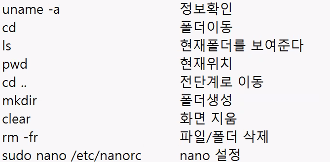

# iot-socket
iot tcp/ip 소켓통신

## 1일차
### 필요한 설치
- vmware 설치 : 구글에 `vmware-workstation-full-17.6.3-24583834.exe(401.43 mb)` 검색 [여기로](https://www.fileeagle.com/software/662/VMware-Workstation-Pro/17.6.3)
- putty 설치 [여기로](https://www.chiark.greenend.org.uk/~sgtatham/putty/latest.html)
- ubuntu iso 설치 [여기로](https://ubuntu.com/download/desktop)

### vmware 가상머신 만들기
- custom -> 빈칸 다 ubuntu로 채우고 -> 올next

### putty 연결
- sudo apt install net-tools
- ifconfig -> 아이피 파악
- sudo apt install openssh-server
- putty에서 우분투로 연결
- sudo apt update
- 상단바 우클릭 -> Change Setting -> Window-Appearance -> 폰트 크기 원하는 대로

### 폴더 생성

- mkdir Work
- cd Work
- mkdir Socket

### 편집기 설정
- sudo nano /etc/nanorc
- set autoindent, set linenumbers, set tapsize 활성화, tapsize는 3으로 변경 (나는 4로 했지만)
- 컨트 s, 컨트 x 

### 파일 다루기
- touch text.txt -> 파일 생성
- nano text.txt -> 파일 편집
- cat text.txt -> 파일 내용 보기
- cp text.txt text1.text -> 파일 카피
- mv ./text.txt ../ -> 이전 경로로 파일 이동

### c언어 시작
- nano main.c
- 간단한 출력문 작성 후 저장
- putty 상단바 우클릭 -> Duplicate Session
- sudo apt install gcc
- gcc main.c -> 실행파일 'a.out'이 생성됨.
- ./a.out 입력 시 실행
- gcc main.c -o main -> 실행파일 'main'이 생성됨.

### 공유폴더 생성
- 깃허브 업로드 편의를 위해 리포지토리 로컬 패스에 설정

- ->[참고 링크](https://developern.tistory.com/entry/VMware-ubuntu-vm%EC%9D%98-%EA%B3%B5%EC%9C%A0%ED%8F%B4%EB%8D%94-Shared-Folders-%EC%84%A4%EC%A0%95-%EB%B0%A9%EB%B2%95)

## 2일차